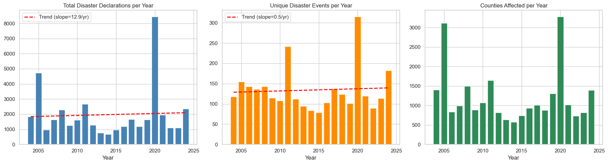
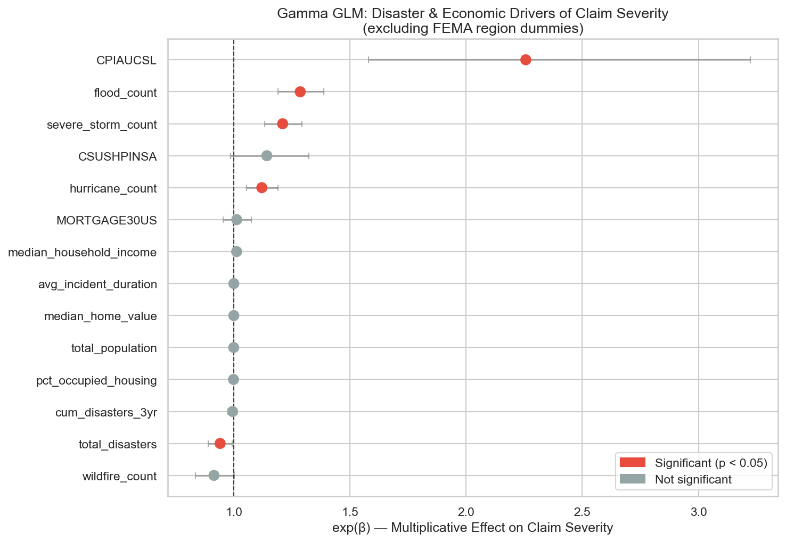
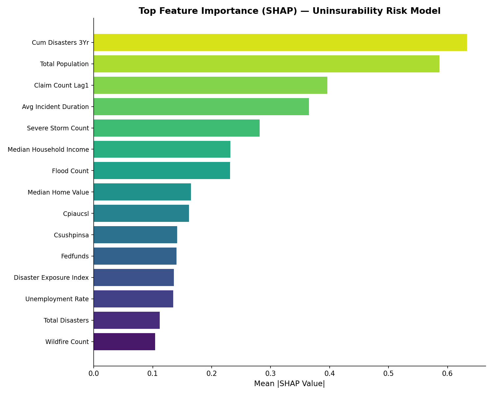
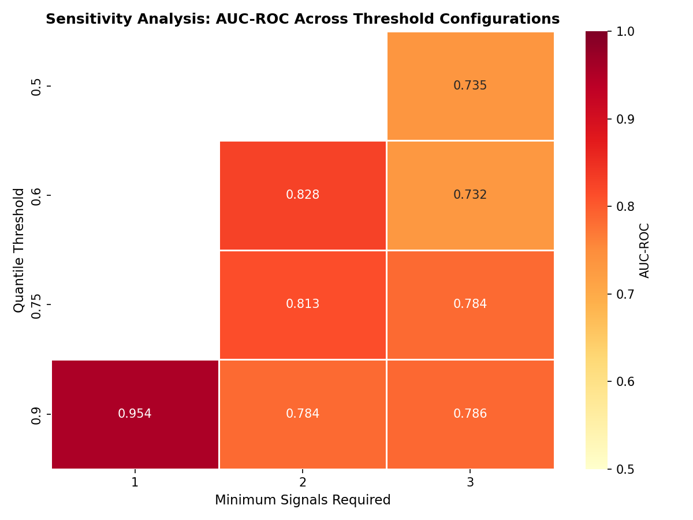
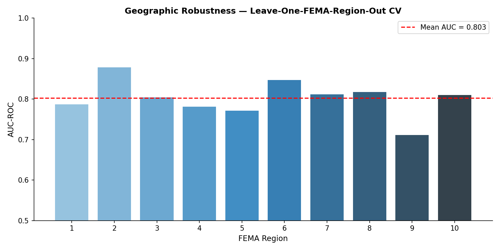
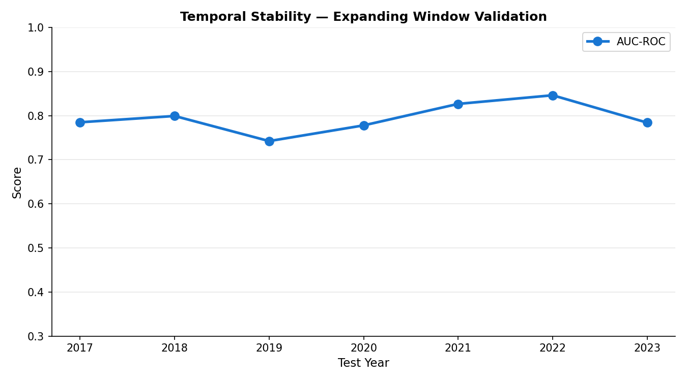

# Climate Risk & Property Insurance Affordability Crisis

**Predicting Insurance Market Instability: Identifying U.S. Counties at Risk of Becoming Uninsurable Due to Climate Disaster Exposure**

An end-to-end data science project analyzing 20 years of federal disaster data, 1.5M+ flood insurance claims, and macroeconomic indicators to quantify how climate disasters drive insurance costs — and predict which regions face affordability crises.

**Author:** Priya More

**[Live Dashboard](https://priya8975-climate-risk-insurance.streamlit.app/)** | **[GitHub Repo](https://github.com/Priya8975/climate-risk-insurance)**

---

## Key Findings

- Natural disaster declarations have **increased 45%** over the 2004–2024 period, with clear seasonal patterns (June–November peak)
- Each additional flood event **increases claim severity by 28.6%** (Gamma GLM, p < 0.001)
- Inflation (CPI) roughly **doubles expected claim payouts** per unit increase
- FEMA Region 6 (TX, LA, AR, OK, NM) shows **154% higher claims** than the national baseline
- A logistic regression with lagged features predicts county-level claims surges with **AUC-ROC = 0.73**
- Gradient Boosting predicts county-level uninsurability risk with **AUC-ROC = 0.83** (test), **0.87** (5-fold CV)
- **Louisiana** dominates the top risk rankings; FEMA Region 6 has highest median risk scores
- SARIMA(0,1,2)(0,1,1,12) outperformed Prophet for disaster forecasting (AIC = 3028)

---

## Modules

| Module | Focus Area | Methods | Status |
|--------|-----------|---------|--------|
| 1 | **Disaster Trend Analysis** | SARIMA, Prophet, Time Series Decomposition | Complete |
| 2 | **Insurance Claims Modeling** | Gamma GLM, Tweedie GLM, Logistic Regression | Complete |
| 3 | **Uninsurability Risk Classification** | Gradient Boosting, Random Forest, SHAP | Complete |
| 4 | **Model Validation & Documentation** | Sensitivity Analysis, Geographic CV, Calibration | Complete |

---

## Project Structure

```
├── data/
│   ├── raw/                → Original API downloads (not in repo)
│   ├── processed/          → Cleaned, merged datasets
│   └── external/           → Census ACS & FRED economic data
├── src/
│   ├── data/
│   │   ├── fetch_fema_data.py          → FEMA API data collection (disasters, claims, policies)
│   │   ├── fetch_external_data.py      → Census ACS + FRED downloads
│   │   ├── process_disasters.py        → Disaster data cleaning & aggregation
│   │   └── process_insurance_data.py   → County-year panel dataset construction
│   ├── models/
│   │   ├── disaster_time_series.py     → SARIMA & Prophet models
│   │   ├── insurance_glms.py           → Gamma GLM, Tweedie GLM, Logistic Regression
│   │   ├── uninsurability_classifier.py → Gradient Boosting, Random Forest, SHAP
│   │   └── model_validation.py          → Sensitivity analysis, robustness, calibration
│   └── utils/
│       └── config.py                   → Centralized configuration & constants
├── notebooks/
│   ├── 01_disaster_eda.ipynb           → Exploratory analysis & visualizations
│   ├── 02_disaster_time_series.ipynb   → Time series modeling results
│   ├── 03_insurance_glm_results.ipynb  → GLM results & interpretation
│   ├── 04_uninsurability_classification.ipynb → ML classification & SHAP analysis
│   └── 05_model_validation.ipynb            → Validation results & visualizations
├── models/                 → Model coefficients, metrics & diagnostics
├── reports/figures/        → Saved visualizations
├── app.py                  → Interactive Streamlit dashboard
└── requirements.txt
```

---

## Data Sources

| Source | Records | Description |
|--------|---------|-------------|
| [OpenFEMA — Disaster Declarations](https://www.fema.gov/api/open/v2/DisasterDeclarationsSummaries) | 41,363 | Federally declared disasters (2004–2024) |
| [OpenFEMA — NFIP Claims](https://www.fema.gov/api/open/v2/FimaNfipClaims) | 1,519,328 | Individual flood insurance claims |
| [OpenFEMA — NFIP Policies](https://www.fema.gov/api/open/v2/FimaNfipPolicies) | ~72M | Flood insurance policies (aggregated to county-year) |
| [OpenFEMA — Housing Assistance](https://www.fema.gov/api/open/v2/HousingAssistanceOwners) | 157,928 | FEMA individual assistance disbursements |
| [Census ACS 5-Year](https://api.census.gov/data/2022/acs/acs5/profile) | 3,222 counties | Demographics, income, housing characteristics |
| [FRED](https://fred.stlouisfed.org/) | 4 series | Fed Funds Rate, CPI, Case-Shiller HPI, 30-yr Mortgage Rate |

---

## Methodology

### Module 1: Disaster Trend Analysis

- Cleaned 45K disaster records → 41,363 analysis-ready records across 3,281 counties
- Created national, state, and county-level monthly aggregations
- Grid-searched **144 SARIMA parameter combinations**; best model: SARIMA(0,1,2)(0,1,1,12)
- Implemented expanding-window cross-validation for temporal forecasting
- Prophet model as baseline comparison

### Module 2: Insurance Claims Modeling

**Panel Dataset Construction:**
Built a county-year panel (25,415 rows × 65 features) by merging disaster counts, NFIP claims, housing assistance, Census demographics, and FRED economic indicators via sequential left joins.

**Claim Severity — Gamma GLM (log link):**
- Models positive claim amounts using the actuarial-standard Gamma distribution
- 10,907 county-years with positive claims; temporal train/test split (≤2021 / 2022–2024)
- 15 of 24 features statistically significant at p < 0.05
- Coefficients have multiplicative interpretation: exp(β) = effect multiplier

**Claim Severity — Tweedie GLM (log link):**
- Handles zero-inflated data (county-years with no claims) via compound Poisson-Gamma distribution
- Grid-searched variance power parameter; best converged model at p = 1.4
- Uses all 25,415 county-years without data exclusion

**Claims Surge Prediction — Logistic Regression:**
- Binary target: >50% year-over-year increase in county claim count
- All features lagged by 1 year for genuine out-of-sample prediction
- Standardized features for comparable odds ratios
- AUC-ROC: 0.687 (test), 0.728 ± 0.015 (5-fold stratified CV)
- Balanced class weights to handle class imbalance (~15% surge rate)

### Module 3: Uninsurability Risk Classification

**Composite Risk Target:**
Constructed a binary "uninsurability risk" label from four signals: high claim severity (top quartile), high cumulative disasters (top quartile), FEMA Housing Assistance damage, and high total claims paid (top quartile). Counties meeting >=2 criteria are labeled high-risk (~18% positive rate). Thresholds computed from training data only to prevent leakage.

**Gradient Boosting Classifier (primary):**
- 300 trees, max_depth=5, learning_rate=0.1, subsample=0.8
- Balanced sample weights for class imbalance handling
- 32 predictive features (no current-year claims — genuine out-of-sample)
- AUC-ROC: 0.83 (test), 0.87 ± 0.01 (5-fold stratified CV)
- Top risk drivers: cumulative disaster exposure, population, lagged claims

**Random Forest Classifier (comparison):**
- 500 trees, max_depth=10, balanced_subsample class weights
- AUC-ROC: 0.82 (test), 0.86 ± 0.01 (5-fold stratified CV)

**SHAP Explainability:**
- TreeExplainer for global and local feature importance
- Beeswarm and dependence plots for top risk drivers
- County-level risk scoring across all 3,240 counties

### Module 4: Model Validation & Documentation

**Sensitivity Analysis:**
- Tested composite target across **16 threshold configurations** (4 quantiles × 4 min_signals); model AUC robust across configurations
- Feature ablation across 5 groups: disaster features are the most critical group
- Claims surge threshold sensitivity (25%–100% YoY)

**Robustness Checks:**
- **Leave-one-FEMA-region-out CV** (10 geographic folds): consistent performance across all regions
- **Expanding-window temporal validation** (7 year splits, 2017–2023): stable AUC across time periods
- **KS tests** for train/test distribution shift: 17/22 features shifted, but model remains robust
- Prediction stability across 5 CV folds: low variance in predictions

**Calibration:**
- Reliability diagrams and Expected Calibration Error (ECE) for both classifiers
- Gradient Boosting shows better calibration than Random Forest

**Cross-Module Summary:**
- Unified report consolidating metrics from all 8 models across 3 modules
- Performance breakdown by FEMA region and test year

---

## Setup & Usage

### Prerequisites
- Python 3.9+
- ~500 MB disk space for data downloads

### Installation

```bash
git clone https://github.com/Priya8975/climate-risk-insurance.git
cd climate-risk-insurance
python3 -m venv venv
source venv/bin/activate
pip install -r requirements.txt
```

### Running the Pipeline

```bash
# Module 1: Data Collection & Processing
python -m src.data.fetch_fema_data          # Fetch disaster declarations + housing assistance
python -m src.data.process_disasters        # Clean & aggregate disaster data

# Module 1: Time Series Modeling
python -m src.models.disaster_time_series   # Fit SARIMA + Prophet

# Module 2: Additional Data Collection
python -m src.data.fetch_external_data      # Fetch Census ACS + FRED data

# Module 2: Panel Construction & GLMs
python -m src.data.process_insurance_data   # Build county-year panel dataset
python -m src.models.insurance_glms         # Fit Gamma, Tweedie & Logistic models

# Module 3: ML Classification
python -m src.models.uninsurability_classifier  # Gradient Boosting, Random Forest, SHAP

# Module 4: Model Validation
python -m src.models.model_validation           # Sensitivity, robustness, calibration

# Explore Results
jupyter notebook notebooks/
```

---

## Selected Visualizations

### Module 1: Disaster Trends (2004–2024)

<p align="center">
  
</p>

> Disaster declarations increased 45% over the study period, with 2020 seeing record-breaking events across 3,000+ counties.

### Module 2: Insurance Claims — What Drives Severity?

<p align="center">
  
</p>

> Gamma GLM forest plot showing multiplicative effects on claim severity. CPI (inflation) roughly doubles payouts; each flood event adds 28.6%.

### Module 3: Uninsurability Risk Classification

<p align="center">
  &nbsp;&nbsp;
  
</p>

> **Left:** Gradient Boosting (AUC = 0.83) outperforms Random Forest (AUC = 0.82) for uninsurability risk prediction. **Right:** SHAP analysis reveals cumulative disaster exposure, population, and lagged claims as top risk drivers.

<p align="center">
  
</p>

> Louisiana dominates the top 20 at-risk counties, with Florida and Texas also heavily represented. All top counties exceed 85% predicted risk probability.

### Module 4: Model Validation & Robustness

<p align="center">
  &nbsp;&nbsp;
  
</p>

> **Left:** AUC-ROC remains strong (0.73–0.95) across 16 threshold configurations, confirming robust target construction. **Right:** Leave-one-FEMA-region-out CV shows consistent performance (mean AUC = 0.80) across all 10 U.S. regions.

<p align="center">
  
</p>

> Expanding-window validation (2017–2023) demonstrates stable AUC-ROC over time — the model generalizes across climate regimes.

*Additional visualizations (30+ total) are available in the [notebooks/](notebooks/) directory.*

---

## Interactive Dashboard

**[Explore the Live Dashboard](https://priya8975-climate-risk-insurance.streamlit.app/)**

An interactive Streamlit dashboard provides live exploration of all results:

```bash
# Or run locally:
streamlit run app.py
```

**Dashboard Pages:**
- **Overview** — Key metrics, cross-module performance summary
- **Disaster Explorer** — Interactive choropleth maps, trends by type/year/state
- **Risk Rankings** — County-level risk scores, filterable tables, FEMA region distributions
- **Model Performance** — Interactive ROC curves, SHAP importance, GLM coefficients
- **Validation & Robustness** — Sensitivity heatmaps, geographic CV, temporal stability

---

## Tech Stack

| Category | Tools |
|----------|-------|
| **Data Processing** | pandas, numpy, requests, tqdm |
| **Statistical Modeling** | statsmodels (GLMs), scikit-learn (Logistic Regression, CV) |
| **ML & Explainability** | scikit-learn (Gradient Boosting, Random Forest, GridSearchCV), SHAP |
| **Time Series** | statsmodels SARIMAX, Prophet |
| **Visualization** | matplotlib, seaborn, plotly |
| **Dashboard** | Streamlit |
| **Environment** | Python 3.9, Jupyter, venv |

---

## License

This project is for educational and portfolio purposes. Data sourced from public U.S. government APIs (OpenFEMA, Census Bureau, FRED).
